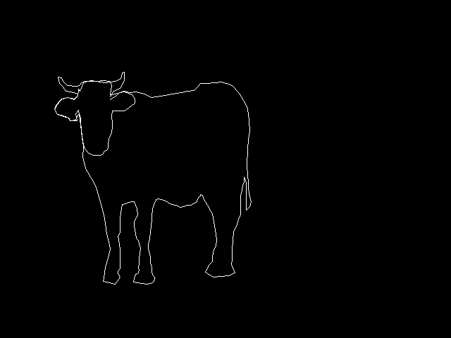

# PythonChallenge
My solutions for http://www.pythonchallenge.com/
## Level 0
Hint: try to change the URL address.  
http://www.pythonchallenge.com/pc/def/0.html  
将url改为1.html,提示：``2**38 is much much larger``.  
计算``2**38``:  

```python
print(2**38)
```
输出结果为``274877906944``  
得到Level 1地址：  
http://www.pythonchallenge.com/pc/def/274877906944.html
## Level 1
图片提示：``K->M``,``O->Q``,``E->G``  
hint：  
```
g fmnc wms bgblr rpylqjyrc gr zw fylb. rfyrq ufyr amknsrcpq ypc dmp. bmgle gr gl zw fylb gq glcddgagclr ylb rfyr'q ufw rfgq rcvr gq qm jmle. sqgle qrpgle.kyicrpylq() gq pcamkkclbcb. lmu ynnjw ml rfc spj.
```
可以猜出该题使用的是恺撒密码，各字母向后位移2位  

```python
intab =  'abcdefghijklmnopqrstuvwxyz'
outtab = 'cdefghijklmnopqrstuvwxyzab'
trantab = str.maketrans(intab,outtab)
str = 'g fmnc wms bgblr rpylqjyrc gr zw fylb. rfyrq ufyr amknsrcpq ypc dmp. bmgle gr gl zw fylb gq glcddgagclr ylb rfyrq ufw rfgq rcvr gq qm jmle. sqgle qrpgle.kyicrpylq() gq pcamkkclbcb. lmu ynnjw ml rfc spj.'
print(str.translate(trantab))
```
输出结果为：  
```
i hope you didnt translate it by hand. thats what computers are for. doing it in by hand is inefficient and thats why this text is so long. using string.maketrans() is recommended. now apply on the url.
```
根据提示，要对url进行转换，现在的url为``map.html``  

```python
str2 = 'map'
print(str2.translate(trantab))
```
输出结果为``ocr``  
得到Level 2地址：  
http://www.pythonchallenge.com/pc/def/ocr.html
## Level 2
hint:``recognize the characters. maybe they are in the book, 
but MAYBE they are in the page source.``  
打开页面源码，发现注释中有大量字符，有这样的提示：  
``find rare characters in the mess below``  
把该部分注释复制到txt文件中以便读取：[level2.txt](./level2.txt)  
要在大量乱码字符中找到英文字母  

```python
with open('level2.txt', encoding='utf-8') as f:
    str = f.read()
target=''
for ch in str:
  if ch.isalpha():
    target+=ch
print(target)
```
输出结果为``equality``  
得到Level 3地址：  
http://www.pythonchallenge.com/pc/def/equality.html
## Level 3
hint:  
``One small letter, surrounded by EXACTLY three big bodyguards on each of its sides.``  
打开网页源码，发现注释中有大量大小写英文字母字符  
把该部分注释复制到txt文件中以便读取：[level3.txt](./level3.txt)    
结合提示，猜想需要找到左右均有三个大写字母的小写字母 . 

```python
with open('level3.txt', encoding='utf-8') as f:
    str = f.read()
target = re.findall(r'[^A-Z][A-Z]{3}([a-z])[A-Z]{3}[^A-Z]',str)
for i in target:
    print(i,end="")
```
输出结果为``linkedlist``  
得到Level 4地址：  
http://www.pythonchallenge.com/pc/def/linkedlist.html  
实际需要跳转至  
http://www.pythonchallenge.com/pc/def/linkedlist.php  
## Level 4
点击图片，页面跳转，url后面增加``nothing=12345``  
页面内容为：``and the next nothing is 44827``  
结合初始页面源码注释中的：  
``urllib may help. DON'T TRY ALL NOTHINGS, since it will never end. 400 times is more than enough.``  
需要借助urllib库不断爬取url中的新值，循环次数可以设为400次  

```python
def nextPage(p):
    url = 'http://www.pythonchallenge.com/pc/def/linkedlist.php?nothing='+p
    str = urllib.request.urlopen(url).read().decode('utf-8')
    try:
        newP = re.search(r'([0-9]+)', str).group(1)
        return newP
    except:
        print(str)
        return ''

p = '12345'
for i in range(1,400):
    print('{}:{}'.format(i,p))
    p = nextPage(p)
```
爬至第86次时，会出现异常情况：  
``Yes. Divide by two and keep going.``  
本来应该手动计算一下再继续爬取，后来发现直接跳过对结果也没有影响  
爬至第357次时出现``peak.html``  
得到Level 5地址：  
http://www.pythonchallenge.com/pc/def/peak.html   
## Level 5
level5的页面标题为``peak hell``,hint为``pronounce it ``  
页面注释中有：``peak hell sounds familiar ? ``  
搜索之后才知道这个需要用的是pickle库  
注释中有文件：``banner.p``，下载至本地以便读取：[banner.p](./banner.p)  
使用pickle库将文件中的字符多维数组格式化输出，转换为字符图像

```python
file = open('banner.p','rb')
str = pickle.load(file)
print(str)
print ('\n'.join([''.join([p[0] * p[1] for p in row]) for row in str]))
```
输出结果为:  
```
              #####                                                                      ##### 
               ####                                                                       #### 
               ####                                                                       #### 
               ####                                                                       #### 
               ####                                                                       #### 
               ####                                                                       #### 
               ####                                                                       #### 
               ####                                                                       #### 
      ###      ####   ###         ###       #####   ###    #####   ###          ###       #### 
   ###   ##    #### #######     ##  ###      #### #######   #### #######     ###  ###     #### 
  ###     ###  #####    ####   ###   ####    #####    ####  #####    ####   ###     ###   #### 
 ###           ####     ####   ###    ###    ####     ####  ####     ####  ###      ####  #### 
 ###           ####     ####          ###    ####     ####  ####     ####  ###       ###  #### 
####           ####     ####     ##   ###    ####     ####  ####     #### ####       ###  #### 
####           ####     ####   ##########    ####     ####  ####     #### ##############  #### 
####           ####     ####  ###    ####    ####     ####  ####     #### ####            #### 
####           ####     #### ####     ###    ####     ####  ####     #### ####            #### 
 ###           ####     #### ####     ###    ####     ####  ####     ####  ###            #### 
  ###      ##  ####     ####  ###    ####    ####     ####  ####     ####   ###      ##   #### 
   ###    ##   ####     ####   ###########   ####     ####  ####     ####    ###    ##    #### 
      ###     ######    #####    ##    #### ######    ###########    #####      ###      ######
```
即``channel``  
得到Level 6地址：  
http://www.pythonchallenge.com/pc/def/channel.html  
## Level 6
页面源码注释有提示：``<-- zip -->``  
将url后缀``html``改为``zip``得到 ``channel.zip``，放入项目文件夹  
调用``zipfile``对压缩文件进行操作  
首先检查一下文件列表：  
 
```python
file = zipfile.ZipFile("channel.zip","r")
for name in file.namelist():
    print(name)
```
输出了全部文件名，发现有一个``readme.txt``文件，查看内容：  

```python
print(file.open("readme.txt").read().decode('utf-8'))
```
输出：  

```
# welcome to my zipped list.
# hint1: start from 90052
# hint2: answer is inside the zip
```
那么就从名字为``90052.txt``的文件开始遍历：  

```python
def nextFile(name):
    path = name+".txt"
    str = file.open(path).read().decode('utf-8')
    try:
        newName = re.search(r'([0-9]+)', str).group(1)
        return newName
    except:
        print(str)
        return ''
p = '90052'
for i in range(1,len(file.namelist())):
    print('{}:{}'.format(i,p))
    p = nextFile(p)
file.close()
```
输出了遍历过程中各文件名字之后，最后有这样的提示：``Collect the comments.``  
根据提示，需要对文件的``comment``进行操作  
以上代码修改为：  

```python
comments=[]
def nextFile(name):
    path = name+".txt"
    str = file.open(path).read().decode('utf-8')
    try:
        newName = re.search(r'([0-9]+)', str).group(1)
        comments.append(file.getinfo(path).comment.decode('utf-8'))
        return newName
    except:
        print(str)
        return ''
p = '90052'
for i in range(1,len(file.namelist())):
    print('{}:{}'.format(i,p))
    p = nextFile(p)
print("".join(comments))

file.close()
```
输出结果为：  

```
****************************************************************
****************************************************************
**                                                            **
**   OO    OO    XX      YYYY    GG    GG  EEEEEE NN      NN  **
**   OO    OO  XXXXXX   YYYYYY   GG   GG   EEEEEE  NN    NN   **
**   OO    OO XXX  XXX YYY   YY  GG GG     EE       NN  NN    **
**   OOOOOOOO XX    XX YY        GGG       EEEEE     NNNN     **
**   OOOOOOOO XX    XX YY        GGG       EEEEE      NN      **
**   OO    OO XXX  XXX YYY   YY  GG GG     EE         NN      **
**   OO    OO  XXXXXX   YYYYYY   GG   GG   EEEEEE     NN      **
**   OO    OO    XX      YYYY    GG    GG  EEEEEE     NN      **
**                                                            **
****************************************************************
 **************************************************************
```
即``hockey``  
打开地址：  
http://www.pythonchallenge.com/pc/def/hockey.html  
提示：``it's in the air. look at the letters.``  
看来答案不是上面图像中的字母形状，改为拼成各字母形状的字母：``oxygen``  
得到Level 7地址：  
http://www.pythonchallenge.com/pc/def/oxygen.html 
## Level 7
本关的页面只有一个图片，源码内没有其他提示  
将图片下载至本地以便处理  
  
看到这个有点懵，搜索了网上的其他解法才知道：要对图片中间不同灰度值的色块对应的像素值进行处理
- 获取像素值（经过验证，这些色块各自的r/g/b值是相同的，获取其中一个即可）
- 像素值即为ascii码，翻译为对应字母输出  
要用到Python中图像处理的Pillow库，之前也用过  

```python
image = Image.open("oxygen.png")
data = [chr(image.getpixel((i, 43))[0]) for i in range(0,609,7)]
print("".join(data))
```
此时输出结果为：  

```
smart guy, you made it. the next level is [105, 110, 116, 101, 103, 114, 105, 116, 121]
```
将``[105, 110, 116, 101, 103, 114, 105, 116, 121]``ascii码对应字母输出：  

```python
msg = [105, 110, 116, 101, 103, 114, 105, 116, 121]
print(''.join([chr(i) for i in msg]))
```
输出结果：``integrity``  
得到Level 8地址：  
http://www.pythonchallenge.com/pc/def/integrity.html 
## Level 8
本关页面显示一张图片，点击图片中的蜜蜂后弹出对话框，要求输入用户名和密码   
查看页面注释，发现有如下提示：  
  
```
<!--
un: 'BZh91AY&SYA\xaf\x82\r\x00\x00\x01\x01\x80\x02\xc0\x02\x00 \x00!\x9ah3M\x07<]\xc9\x14\xe1BA\x06\xbe\x084'
pw: 'BZh91AY&SY\x94$|\x0e\x00\x00\x00\x81\x00\x03$ \x00!\x9ah3M\x13<]\xc9\x14\xe1BBP\x91\xf08'
-->
```
原本猜测这是某种方式加密后的密文，但观察很久也没有思路  
搜索其他解法才知道是bz2格式编码，需要调用``bz2``库：  

```python
un = b'BZh91AY&SYA\xaf\x82\r\x00\x00\x01\x01\x80\x02\xc0\x02\x00 \x00!\x9ah3M\x07<]\xc9\x14\xe1BA\x06\xbe\x084'
pw = b'BZh91AY&SY\x94$|\x0e\x00\x00\x00\x81\x00\x03$ \x00!\x9ah3M\x13<]\xc9\x14\xe1BBP\x91\xf08'

username = bz2.decompress(un)
password = bz2.decompress(pw)
print(username,password)
```
输出：``b'huge' b'file'``，用户名和密码应分别为``huge``和``file``  
输入对话框，跳转至Level 9：  
http://www.pythonchallenge.com/pc/return/good.html  
## Level 9
这一关标题是：``connect the dots``，查看源码发现有这样的注释：  

```
<!--
first+second=?

first:
146,399,163,403,170,393,169,391,166,386,170,381,170,371,170,355,169,346,167,335,170,329,170,320,170,
310,171,301,173,290,178,289,182,287,188,286,190,286,192,291,194,296,195,305,194,307,191,312,190,316,
190,321,192,331,193,338,196,341,197,346,199,352,198,360,197,366,197,373,196,380,197,383,196,387,192,
389,191,392,190,396,189,400,194,401,201,402,208,403,213,402,216,401,219,397,219,393,216,390,215,385,
215,379,213,373,213,365,212,360,210,353,210,347,212,338,213,329,214,319,215,311,215,306,216,296,218,
290,221,283,225,282,233,284,238,287,243,290,250,291,255,294,261,293,265,291,271,291,273,289,278,287,
279,285,281,280,284,278,284,276,287,277,289,283,291,286,294,291,296,295,299,300,301,304,304,320,305,
327,306,332,307,341,306,349,303,354,301,364,301,371,297,375,292,384,291,386,302,393,324,391,333,387,
328,375,329,367,329,353,330,341,331,328,336,319,338,310,341,304,341,285,341,278,343,269,344,262,346,
259,346,251,349,259,349,264,349,273,349,280,349,288,349,295,349,298,354,293,356,286,354,279,352,268,
352,257,351,249,350,234,351,211,352,197,354,185,353,171,351,154,348,147,342,137,339,132,330,122,327,
120,314,116,304,117,293,118,284,118,281,122,275,128,265,129,257,131,244,133,239,134,228,136,221,137,
214,138,209,135,201,132,192,130,184,131,175,129,170,131,159,134,157,134,160,130,170,125,176,114,176,
102,173,103,172,108,171,111,163,115,156,116,149,117,142,116,136,115,129,115,124,115,120,115,115,117,
113,120,109,122,102,122,100,121,95,121,89,115,87,110,82,109,84,118,89,123,93,129,100,130,108,132,110,
133,110,136,107,138,105,140,95,138,86,141,79,149,77,155,81,162,90,165,97,167,99,171,109,171,107,161,
111,156,113,170,115,185,118,208,117,223,121,239,128,251,133,259,136,266,139,276,143,290,148,310,151,
332,155,348,156,353,153,366,149,379,147,394,146,399

second:
156,141,165,135,169,131,176,130,187,134,191,140,191,146,186,150,179,155,175,157,168,157,163,157,159,
157,158,164,159,175,159,181,157,191,154,197,153,205,153,210,152,212,147,215,146,218,143,220,132,220,
125,217,119,209,116,196,115,185,114,172,114,167,112,161,109,165,107,170,99,171,97,167,89,164,81,162,
77,155,81,148,87,140,96,138,105,141,110,136,111,126,113,129,118,117,128,114,137,115,146,114,155,115,
158,121,157,128,156,134,157,136,156,136

-->
```
结合起来猜想，需要以某种方式把``first``和``second``对应的点连起来进行观察  
再次使用Pillow库  

```python
first = [146,399,163,403,170,393,169,391,166,386,170,381,170,371,170,355,169,346,167,335,170,329,170,320,170,
310,171,301,173,290,178,289,182,287,188,286,190,286,192,291,194,296,195,305,194,307,191,312,190,316,
190,321,192,331,193,338,196,341,197,346,199,352,198,360,197,366,197,373,196,380,197,383,196,387,192,
389,191,392,190,396,189,400,194,401,201,402,208,403,213,402,216,401,219,397,219,393,216,390,215,385,
215,379,213,373,213,365,212,360,210,353,210,347,212,338,213,329,214,319,215,311,215,306,216,296,218,
290,221,283,225,282,233,284,238,287,243,290,250,291,255,294,261,293,265,291,271,291,273,289,278,287,
279,285,281,280,284,278,284,276,287,277,289,283,291,286,294,291,296,295,299,300,301,304,304,320,305,
327,306,332,307,341,306,349,303,354,301,364,301,371,297,375,292,384,291,386,302,393,324,391,333,387,
328,375,329,367,329,353,330,341,331,328,336,319,338,310,341,304,341,285,341,278,343,269,344,262,346,
259,346,251,349,259,349,264,349,273,349,280,349,288,349,295,349,298,354,293,356,286,354,279,352,268,
352,257,351,249,350,234,351,211,352,197,354,185,353,171,351,154,348,147,342,137,339,132,330,122,327,
120,314,116,304,117,293,118,284,118,281,122,275,128,265,129,257,131,244,133,239,134,228,136,221,137,
214,138,209,135,201,132,192,130,184,131,175,129,170,131,159,134,157,134,160,130,170,125,176,114,176,
102,173,103,172,108,171,111,163,115,156,116,149,117,142,116,136,115,129,115,124,115,120,115,115,117,
113,120,109,122,102,122,100,121,95,121,89,115,87,110,82,109,84,118,89,123,93,129,100,130,108,132,110,
133,110,136,107,138,105,140,95,138,86,141,79,149,77,155,81,162,90,165,97,167,99,171,109,171,107,161,
111,156,113,170,115,185,118,208,117,223,121,239,128,251,133,259,136,266,139,276,143,290,148,310,151,
332,155,348,156,353,153,366,149,379,147,394,146,399]

second = [156,141,165,135,169,131,176,130,187,134,191,140,191,146,186,150,179,155,175,157,168,157,163,157,159,
157,158,164,159,175,159,181,157,191,154,197,153,205,153,210,152,212,147,215,146,218,143,220,132,220,
125,217,119,209,116,196,115,185,114,172,114,167,112,161,109,165,107,170,99,171,97,167,89,164,81,162,
77,155,81,148,87,140,96,138,105,141,110,136,111,126,113,129,118,117,128,114,137,115,146,114,155,115,
158,121,157,128,156,134,157,136,156,136]

img = Image.new('RGB', (640,480))
draw = ImageDraw.Draw(img)
draw.line(first)
draw.line(second)
img.show()
img.save('level9.png')
```
得到如下图片：  

看起来是一头公牛，尝试单词``bull``  
得到Level 10地址：  
http://www.pythonchallenge.com/pc/def/bull.html 